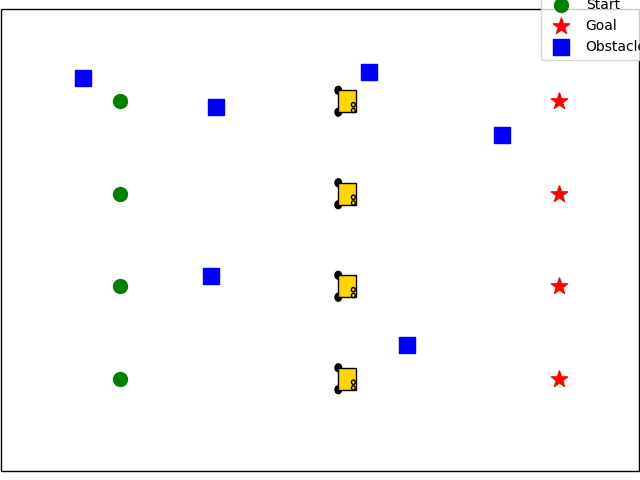
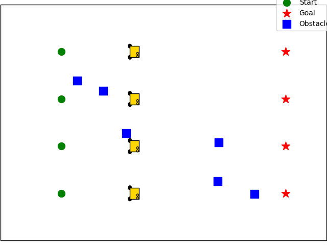
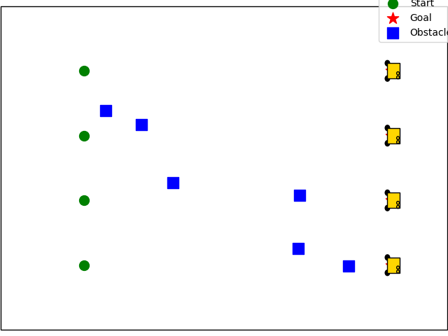

# Multi-Robot Robotarium Simulation

A Python-based multi-robot simulation developed using the Robotarium platform. The project simulates four robots navigating through a shared environment toward individual goal positions using waypoint-based navigation and position control.

## Overview

This project was developed as part of my robotics studies to explore multi-robot coordination, robot navigation, motion control, and simulation.

The simulation initializes four robots at different starting positions. Each robot is assigned a goal and a sequence of waypoints to follow. Random obstacles are generated within the environment to introduce navigation constraints.

## Features

- Four-robot simulation using Robotarium
- Individual starting and goal positions
- Waypoint-based navigation
- Position-based control
- Distance tolerance for waypoint progression
- Random obstacle generation
- Matplotlib visualization
- Simulated robot movement and coordination

## Technologies

- Python
- NumPy
- Matplotlib
- Robotarium Python Simulator

## How It Works

Each robot is assigned a series of waypoints between its starting position and final goal.

During each simulation step:

1. The current position of each robot is obtained.
2. A position controller calculates the required velocity.
3. The robot moves toward its current waypoint.
4. When the robot reaches the waypoint within a defined tolerance, it moves to the next waypoint.
5. The simulation continues until the robots have progressed through their assigned waypoints.

Random obstacles are also generated within the simulation environment while avoiding the initial and goal positions.

## Simulation

### Initial Environment



### Robot Navigation



### Final Environment



## What I Learned

### Through this project, I gained practical experience with:

1. Multi-robot coordination
2. Robot simulation
3. Waypoint-based navigation
4. Position control
4. Working with robot poses and velocities
5. Generating and visualizing simulation environments
6. Using Python libraries such as NumPy and Matplotlib
7. Debugging and testing robotic behaviour in simulation
7. Future Improvements

### Possible improvements to the simulation include:

1. Implementing more advanced obstacle avoidance
2. Adding collision detection between robots and obstacles
3. Improving path planning
4. Adding dynamic obstacles
5. Recording and analyzing robot trajectories

##Author
Lemark Santos

## Project Structure

```text
multi-robot-robotarium-simulation/
│
├── multi_robot_simulation.py
├── README.md
└── images/
    ├── initial-simulation.png
    └── robots-navigating.png


Author

Lemark Santos
